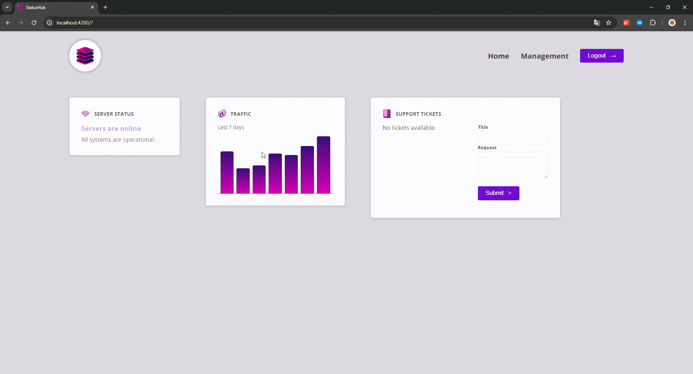

# Documentation for **StatusHub**

#### Overview

**StatusHub** is an Angular-based web application designed to provide an intuitive interface for monitoring system statuses and managing tickets. The application follows a modular architecture to ensure scalability, maintainability, and ease of development.

---

## Demo



---

## Project Structure

The project adheres to the Angular file and folder conventions, with additional customizations for a clear separation of features and shared components.

- **src/app/**: Main application directory containing all feature modules and shared components.
  - **dashboard/**: Handles the dashboard functionality, including:
    - **dashboard-item/**: A module or component for individual dashboard items.
    - **server-status/**: A module or component to monitor server statuses.
  - **tickets/**: Manages ticket-related functionality.
    - **new-ticket/**: A module or component for creating new tickets.
    - **ticket/**: A module or component for displaying ticket details.
    - `tickets.component.ts`: Main entry point for the ticket system module.
  - **traffic/**: A module or component for traffic monitoring (details can be added based on functionality).
  - **header/**: Contains components related to the application header and navigation.
  - **shared/**: Contains reusable components or modules, such as:
    - **button/**: Custom button components.
    - **control/**: Custom controls for forms or inputs.
- **src/styles.scss**: Global styles for the application.
- **src/app.component.\***: Main application entry point, including HTML, SCSS, and TypeScript.

---

## Key Features

1. **Dashboard**:

   - Visual representation of key system metrics.
   - Server status monitoring.

2. **Ticket Management**:

   - Create, update, and view tickets.
   - Separate modules for new ticket creation and detailed ticket views.

3. **Traffic Analysis**:

   - Traffic-related functionality (pending detailed implementation).

4. **Reusable Components**:
   - Buttons and form controls to maintain consistent design.

---

## How to Run the Project

1. **Clone the Repository**:

   ```bash
   git clone https://github.com/FilonenkoDima/StatusHub.git
   cd StatusHub
   ```

2. **Install Dependencies**:
   Ensure you have Node.js and Angular CLI installed, then run:

   ```bash
   npm install
   ```

3. **Run the Application**:

   ```bash
   ng serve
   ```

   The app will be accessible at `http://localhost:4200/`.

4. **Build for Production**:
   ```bash
   ng build --prod
   ```

---

## Technologies Used

- **Frontend**: Angular
- **Styling**: SCSS
- **Build Tools**: Angular CLI
- **Version Control**: GitHub

---

## Contribution Guidelines

1. Fork the repository.
2. Create a new feature branch:
   ```bash
   git checkout -b feature/your-feature-name
   ```
3. Commit your changes and push the branch:
   ```bash
   git push origin feature/your-feature-name
   ```
4. Submit a pull request for review.
